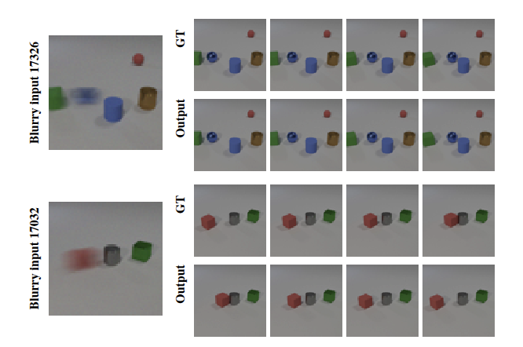

# Image Motion Blur Removal in the Temporal Dimension with Video Diffusion Models
Wang Pang1\*, Zhihao Zhan2\*, Xiang Zhu2\*, and Yechao Bai1#

(*Equal contribution, #Corresponding author)

1Nanjing University, 2TopXGun Robotics

[Project Page](https://zhan994.github.io/temporal-motion-deblur/)

